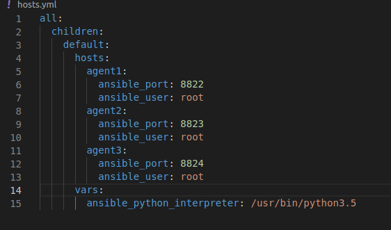

# ansible-playbooks
This is repo with my firsts ansible-playbooks.

Use playbooks:

paste command to terminal: `ansible-playbook -i hosts.yml -u root ansible-playbooks/NAMEFILE.yml`

example:`ansible-playbook -i hosts.yml -u root ansible-playbooks/installpackages.yml`
example:`ansible-playbook -i hosts.yml -u root ansible-playbooks/update-upgrade.yml`

If You want simple-test connection with your serwers, You can use:

ansible -i hosts.yml all -u root -k -m ping

Example hosts.yml file:

